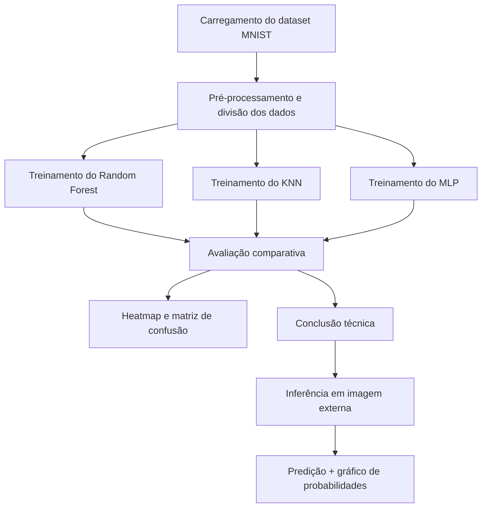

# Predict Number

## Mini Projeto M2 - Predição de Dígitos Manuscritos

## 1. Problema que o projeto resolve

Este projeto resolve o problema de classificação automática de dígitos manuscritos usando o dataset MNIST, com foco em desenvolver um pipeline completo de aprendizado de máquina capaz de:

- carregar imagens do dataset MNIST;
- treinar diferentes classificadores;
- comparar o desempenho entre modelos;
- reutilizar os modelos treinados para prever dígitos em imagens externas;
- avaliar o comportamento do sistema em situações desafiadoras, como classes ocultas e entradass fora da distribuição de treino.

Em outras palavras, o sistema busca automatizar a tarefa de reconhecer dígitos manuscritos e, ao mesmo tempo, demonstrar como modelos de IA reagem quando recebem entradas não vistas durante o treinamento.

## 2. O que o sistema oferece

O projeto oferece:

- treinamento de 3 modelos distintos para classificação multiclasse;
- análise comparativa de métricas;
- visualização de matrizes de confusão com heatmap;
- inferência em imagens próprias selecionadas pelo usuário;
- pré-processamento específico para aproximar a imagem externa do padrão do MNIST;
- análise de overconfidence e do efeito de classes ocultas.

## 3. Técnicas, tecnologias e linguagens utilizadas

### 3.1 Linguagens

- Python
- Jupyter Notebook

### 3.2 Bibliotecas e frameworks

- numpy==2.5.3
- pandas==3.0.5
- scikit-learn==1.9.0
- tensorflow==2.21.0
- matplotlib==3.11.1
- Pillow==12.3.0
- jupyter==1.1.1

### 3.3 Técnicas aplicadas

- Pré-processamento de imagens em escala de cinza;
- Normalização para o intervalo [0, 1];
- Redimensionamento e centralização para o formato MNIST (28x28);
- Uso de modelos clássicos e redes neurais:
  - Random Forest
  - KNN
  - MLP
- Avaliação com matrizes de confusão e `classification_report`;
- Comparação de métricas (`Accuracy`, `Precision`, `Recall`, `F1-Score`);
- Inferência em imagens manuscritas externas;
- Testes de robustez com classes ocultas;
- Análise de falsas certezas (`overconfidence`).

### 3.4 Diagrama geral do fluxo do projeto



## 4. Estrutura do repositório

```text
Mini_Projeto_M2/
├── Predict_number.ipynb        # Notebook principal
├── README.md                   # Documentação do projeto
├── requirements.txt            # Dependências do ambiente
├── data/                      # Imagens de exemplo
├── .venv/                     # Ambiente virtual local
├── .gitignore
└── .vscode/
```

## 5. Requisitos do ambiente

Antes de executar, certifique-se de que o ambiente possui:

- Python 3.10 ou superior;
- `pip` atualizado;
- acesso à internet para baixar o dataset MNIST do OpenML;
- ambiente com suporte para Jupyter Notebook.

## 6. Como executar o projeto

### 6.1 Clone o repositório

```bash
git clone <url-do-repositorio>
cd Mini_Projeto_M2
```

### 6.2 Crie um ambiente virtual

```bash
python -m venv .venv
```

Windows:

```bash
.venv\Scripts\activate
```

Linux/macOS:

```bash
source .venv/bin/activate
```

### 6.3 Instale as dependências

```bash
pip install -r requirements.txt
```

### 6.4 Abra o notebook

```bash
jupyter notebook
```

Depois, abra o arquivo `Predict_number.ipynb` e execute as células na ordem em que aparecem.

## 7. Como usar o sistema

### 7.1 Fluxo principal

1. Execute a célula de carregamento do MNIST.
2. Rode as células de divisão dos dados e normalização.
3. Execute as células de treinamento dos três modelos.
4. Rode a célula de avaliação comparativa.
5. Analise as métricas e a matriz de confusão.
6. Para testar uma imagem externa, execute a célula final de inferência.
7. Selecione a imagem desejada e observe:
   - o resultado original e processado;
   - a classe prevista;
   - as probabilidades por classe.

### 7.2 Observações úteis

- O notebook já reutiliza modelos treinados previamente, evitando retrainamento desnecessário.
- O pré-processamento foi pensado para aproximar a imagem externa do padrão MNIST.
- A qualidade da inferência depende muito da qualidade e do contexto da imagem.

## 8. Resultados esperados

Ao final da execução, o projeto permite observar:

- qual modelo teve melhor desempenho;
- quais dígitos normalmente são confundidos;
- como o modelo se comporta com classes não vistas;
- como probabilidades altas podem esconder erros de classificação.

## 9. Melhorias que podem ser aplicadas

Algumas melhorias possíveis para evoluir o projeto incluem:

- adicionar mais modelos, como SVM ou CNN;
- aplicar técnicas avançadas de aumento de dados (Data Augmentation);
- melhorar o pré-processamento com detecção automática de bordas e threshold adaptativo;
- criar uma interface gráfica mais amigável;
- salvar os modelos treinados em arquivos para reutilização direta;

## 10. Conclusão

Este projeto é uma solução prática e didática para classificação de dígitos manuscritos com Python e machine learning. Ele não apenas treina e compara modelos, mas também mostra como esses modelos se comportam em condições mais próximas do mundo real, incluindo imagens externas e cenários de classes ocultas.


